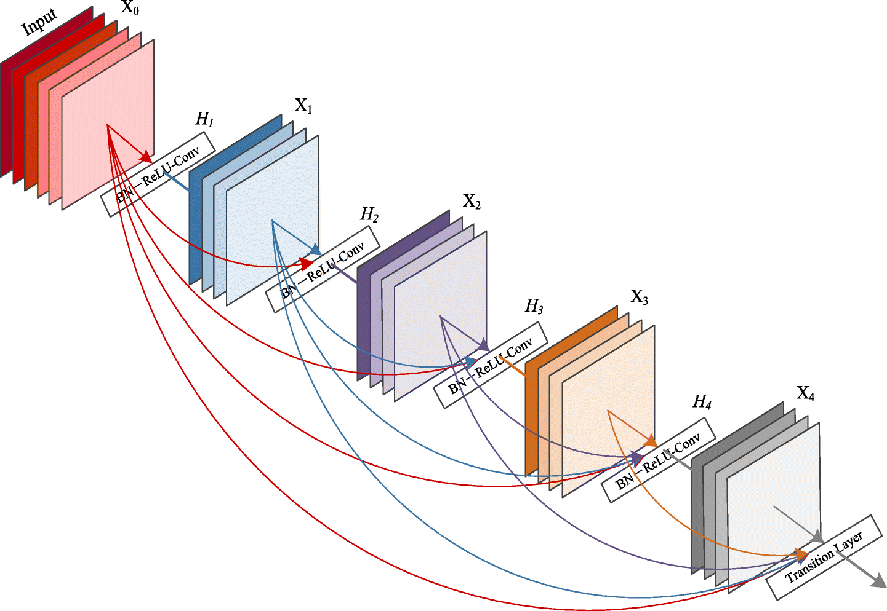

= More In-Depth Look Into YOLOv4
:author: 林祥瑞 / R06922148 / 資訊工程研究所
:revealjs_theme: black
:customcss: custom.css
:data-uri:
:stem: latexmath
:revealjsdir: bower_components/reveal.js
:source-highlighter: highlightjs

== Outline

The lecture covers two topics:

- *Convolution variants*: Understood the principle behind various kinds of convolutions.
- *CSPNet*: The building block for YOLOv4.

== Convolution Revised

=== Convolution Layer Variants

- Grouped convolution
- Depth-wise separable convolution
- Grid convolution
- Depth-wise convolution

Question: Is there a global principle governing the variants?

=== The Einstein Notation

- Consider stem:[\sum_i c_i x^i = c_1 x^1 + c_2 x^2 + c_3 x^3].
- The summation is simplified as stem:[c_i x_i]. The paired subscript and superscript induce summation.
- It applies to multiple summation: stem:[x_i^j y_j^k z_k^i = \sum_i \sum_j \sum_k x_i^j y_j^k z_k^i].

=== Vector, Matrix, Tensor

- Vector is regarded as a tensor with single superscript stem:[v^i].
- Matrix is regarded as a tensor with one subscript and one superscript stem:[M_j^i].
- The matrix product can be denoted in Einstein notation: stem:[y^j = M_i^j x^i].

=== Superscript vs. Subscript

Superscripted -> vector

[stem]
++++
\left [ v^i \right ] = \begin{bmatrix}
v^0 \\
\vdots \\
v^N
\end{bmatrix}
++++

Subscripted -> covector (or linear form)

[stem]
++++
\left [ v_i \right ] = \begin{bmatrix}
v_0 && \cdots && v_N
\end{bmatrix}
++++

Raising or lowing the index can be understood as matrix transposition.

=== Tensor Contraction

- For stem:[y^j = M_i^j x^j], the values are summed up over index stem:[j]. We say index stem:[j] is _contracted_.
- Tensor is an algebraic object with multiple indexes stem:[T_{p_1, \cdots, p_N}^{q_1, \cdots, q_M}]
- The transformation of image from stem:[M] to stem:[N] pixels, and from stem:[C] to stem:[D] channels is denoted as stem:[Y^{n d} = T_{m c}^{n d} X^{m c}].

=== Tensor Contraction

[stem]
++++
\begin{bmatrix}
Y_{0,0} \\
\vdots \\
Y_{N,D}
\end{bmatrix}

=

\begin{bmatrix}
T_{0,0}^{0,0} && \cdots && T_{M,C}^{0,0} \\
\vdots && \ddots && \vdots \\
T_{0,0}^{N,D} && \cdots && T_{M,C}^{N,D}
\end{bmatrix}

\begin{bmatrix}
X_{0,0} \\
\vdots \\
X_{M,C}
\end{bmatrix}
++++

=== Convolution Realized

Source: https://data-flair.training/blogs/keras-convolution-neural-network/

=== Convolution in Tensor Algebra

Convolution is a restriction to the transformation in stem:[Y^{n d} = T_{m c}^{n d} X^{m c}] such that

[stem]
++++
T_{m c}^{n d} = C_{k m}^{n} K_{c}^{k d}
++++

The stem:[K] is the convolution kernel indexed by input channel stem:[c] and output channel stem:[d].

=== Depth-wise Separable Convolution

Depth-wise separable convolution comprises of two steps.

1. *Depth-wise convolution*: Independent convolution per channel (link:image/depthwise_conv.png[figure])
2. *Point-wise convolution*: 1x1 convolution (link:image/pointwise_conv.png[figure])

Source: link:https://arxiv.org/abs/1704.04861[MobileNets: Efficient Convolutional Neural Networks for Mobile Vision Applications]

=== Depth-wise Separable Convolution

Depth-wise separable convolution is a special case of convolution that can be decomposed.

[stem]
++++
T_{m c}^{n d} = C_{k m}^{n} K_{ c}^{k d} = C_{k m}^{n} P_{c}^{d} I^{c'}  D_{c'}^{k}
++++

where

- stem:[ D_{c'}^{k}] is depth-wise convolution kernel, stem:[I^{c'}] is constant 1 tensor.
- stem:[P_{c}^{d}] forms a point-wise convolution kernel.

=== Depth-wise Separable Convolution

- Convolution kernel stem:[K_c^{k d}] has stem:[k c d] parameters.
- Depth-wise separable convolution kernels stem:[D_{c'}^k, P_{c}^{d}] have stem:[k c + c d] parameters.

=== Grouped Convolution

We divide both input stem:[c] and output stem:[d] channels into stem:[v] groups. Each group independently runs convolution.

image::image/grouped_conv.png[grouped convolution]

=== Grouped Convolution Kernel

- There are stem:[v] groups.
- Each group has stem:[\frac{c}{v}] input channels and stem:[\frac{d}{v}] output channels.
- Each group has a convolution kernel with stem:[k \cdot \frac{c}{v} \cdot \frac{d}{v}] parameters. Thus, stem:[\frac{k c d}{v}] parameters in total.
- The kernel tensor can be denoted as stem:[K_i^{\frac{c}{v} \frac{d}{v}}] where stem:[0 \le i \lt v] is group index. It leads to alternative factorization of general convolution.

=== Convolution Variants are Factorizations

- Depth-wise and grouped convolution are basically different ways to factorize kernels.
- Using the same idea, let's invent a _channel-independent convolution_.

[stem]
++++
K_{c}^{k d} = F_c^e K_{e}^{k d}
++++

where stem:[F_c^e] changes the input image from stem:[c] to stem:[e] channels. Then, apply the kernel stem:[K_{e}^{k d}] with fixed number of in/output channels.

=== Composition of Convolution Kernel

Suppose two consecutive convolutions:

- First, stem:[K_{c_1}^{k_1 c_2}] goes from stem:[c_1] to stem:[c_2] channels with kernel size stem:[k_1].
- stem:[K_{c_2}^{k_2 c_3}] goes from stem:[c_2] to stem:[c_3] channels with kernel size stem:[k_2].
- We can compose the two into one kernel.

[stem]
++++
K_{c_1}^{k_1 c_2} K_{c_2}^{k_2 c_3} = K_{c_1}^{\langle k_1 \cdot k_2 \rangle c_3}
++++

=== Composition of Convolution Kernel

=== Remarks Convolution Kernel Composition

- Addition of two kernels works similarly.
- That's why we seldom run two convolutions consecutively.

== CSPNet

=== Overview

- CSPNet: A New Backbone that can Enhance Learning Capability of CNN (link:https://arxiv.org/abs/1911.11929[paper link])
- Authored by Chien-Yao Wang and Hong-Yuan Mark Liao et al. Same authors of YOLOv4 paper.
- Adopted by YOLOv4.
- It reduces 19% computation at the same top-1 accuracy for DenseNet, and reduces 22% computation for ResNeXt.

=== Benchmark

=== From DenseNet to CSPNet

=== DenseNet Architecture

Source: https://ai-pool.com/m/densenet-1568742493

=== Computing DenseNet (Naïve)

image::image/densenet_compute_1.svg[opts=inline]

=== Computing DenseNet (Naïve)

- Let stem:[D_{i,j}] the weight from i^th^ to j^th^ layer.
- To compute j^tj^ layer output stem:[x_j], we compute the summation stem:[x_j = w_{0,j} x_0 + \cdots + w_{j-1,j} x_{j-1}].

=== Computing DenseNet

=== Computing DenseNet

- To compute j^tj^ layer output stem:[x_j], concatenate all previous layers first and apply to a big weight.

[stem]
++++
x_j = w_j \cdot \left [ x_0, x_1, \cdots, x_{j-1} \right ]
++++

=== Deriving CSPNet

The densenet formula.

=== Deriving CSPNet

We derive the weight update formula for densenet.

- stem:[w_{1}^\prime] goes one more time step than stem:[w_{1}].
- stem:[f(\cdot)] is the weight update formula.
- stem:[g_i] represents the gradient propagated to the i^th^ dense layer.
- (The formula seems buggy.)

=== Deriving CSPNet

"We can findthat large amount of gradient information are reused for updating weights of different dense layers. This will result indifferent dense layers repeatedly learn copied gradient information."

=== Deriving CSPNet - Partial Dense Block

=== Deriving CSPNet - Partial Dense Block

We introduce the transition layer to "truncate" the gradients.

=== Benchmark against PeleeNet

=== Benchmark against PeleeNet

=== Benchmark on ImageNet

link:image/imagenet_bench.png[performance chart]
