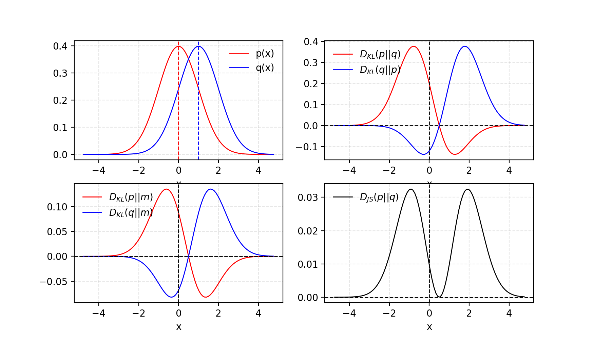
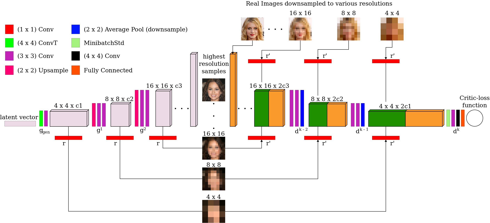
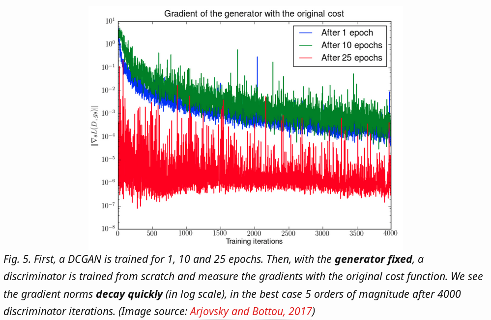
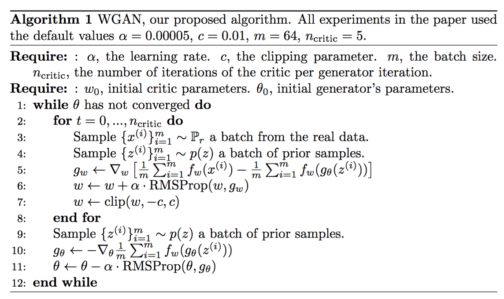

= Understand Deep Generative Models from Ground Up
:author: 林祥瑞
:revealjs_theme: black
:customcss: custom.css

== Warning

The lecture has 40 min time limit and we have length slides to consume. We may skip some pages.

== Mathematical Foundations

We will go thru these topics.

- Information Theory
- KL-divergence

=== Information Theory - Recap

- The amount of information can be understood as the  _surpriseness_ of an event.
- That is, rare events give us more information. We need more bits to encode that event in terms of binary encoding.
- Suppose we have a fair dice, which is represented by a rv stem:[X] with events stem:[\{1, 2, 3, 4, 5, 6\}]. The amount of information of event stem:[X = 3] is measured by stem:[I(X = 3) = \log_2 \frac{1}{P(X = 3)} \approx 2.58].

=== Information Theory - Information Content

- The amount of information can be intuitively understood as # of perfect queries to locate that event.
- Suppose our stem:[X = 3] example. We ask three yes-no queries to find it out.
    * Is it greater than or equal to 4? No
    * Is it greater or equal to 2? Yes
    * Is it 3? Yes
- With perfect yes-no query, it is expected to ask stem:[\log_2 \frac{1}{P(X = 3)}] questions.

=== Information Theory - Information Content
    
- In fact, we need law of large numbers and many theories to show this idea. It is out of scope in this lecture.
- The information content is additive on individual events. Suppose we roll the dice twice. The information content of joint event stem:[X_1 = 3, X_2 = 2] is

[stem]
++++
\begin{aligned}
\log_2 \frac{1}{P(X_1 = 3, X_2 = 2)} \\
= \log_2 \frac{1}{P(X_1 = 3)} + \log_2 \frac{1}{P(X_2 = 2)} \\
= I(X_1 = 3) + I(X_2 = 2)
 \end{aligned}
++++

=== Information Theory - Entropy
    
- The (Shannon) entropy of rv stem:[X], denoted as stem:[H(x)], can be understood as expected amount of information.
- Suppose a rv stem:[X] and its pdf/pmf stem:[P(x)].

[stem]
++++
\begin{aligned}
H(X) \ \\
= E_{X \sim P}[I(X)] \ \\
= \sum_x P(x) \log_b \frac{1}{P(x)} \ \text{(discrete)} \\
= \int_x P(x) \log_b \frac{1}{P(x)} \ \text{(continuous)}
\end{aligned}
++++

- The entropy is usually interpreted as the randomness of a random variable.

=== Information Theory - Information Gain

- What if we encode a true distribution stem:[P] with artifact distribution stem:[Q]?
- Encoding based on stem:[Q] can be thought of as an imperfect query for stem:[P].
- The difference stem:[E_{x \sim P(x)}[\frac{1}{Q(x)}\] - E_{x \sim P(x)}[\frac{1}{P(x)}\]] is always non-negative due to Gibb's inequality.

=== Information Theory - Conditional Entropy

- Suppose you have the knowledge of rv stem:[Y], and would like to know the randomness of rv stem:[X]. It can be modeled as conditional entropy stem:[H(X|Y)].
- The rationale goes as following:
    * Given value stem:[y], stem:[H(X | Y = y) = \sum_x P(X = x | Y = y) \log \frac{1}{P(X = x | Y = y)} ]
    * stem:[H(X|Y) = \sum_y P(y) H (X | Y = y)] is expected value over stem:[y].

=== Information Theory - Conditional Entropy

- stem:[H(X | Y)] is smaller than or equal to stem:[H(X)] because you have prior knowledge of stem:[Y].
- For example, stem:[X] indicates whether teacher is inside R442, and stem:[Y] is whether you observe teacher walk into R442.
- stem:[H(x) \gt 0] because you cannot make sure his or her existence. stem:[H(X|Y)] is strictly less than stem:[H(X)] because you know the outcome of stem:[X] if stem:[Y = \text{true}].
- stem:[H(X) = H(X|Y)] if stem:[X] and stem:[Y] are individual events.

=== Information Theory - Mutual Information

- The dependence of rvs stem:[X, Y] is modeled as mutual information stem:[I(X; Y)].
- In fact,

[stem]
++++
\begin{aligned}
I(X; Y) \\
= H(X) - H(X | Y) \\
= H(Y) - H(Y | X) \\
= H(X) + H(Y) - H(X, Y) \\
= H(X, Y) - H(X|Y) - H(Y|X)
\end{aligned}
++++

=== Information Theory - Mutual Information

[.small]#Reference: link:https://en.wikipedia.org/wiki/Conditional_entropy[Wikipedia: Conditional Entropy]#

=== Kullback–Leibler Divergence

- Suppose two probability distributions stem:[P] and stem:[Q]. The Kullback–Leibler divergence of stem:[P] with respect to stem:[Q] is formulated as:

[stem]
++++
D_{\text{KL}} (P \parallel Q) = E_{x \sim P}[\log \frac{1}{Q(x)}] - E_{x \sim P}[\log \frac{1}{P(x)}]
++++

- The divergence is non-negative due to Gibb's inequality.

=== Kullback–Leibler Divergence - Interpretations

- stem:[P] is regarded as _true_ probability, and stem:[Q] is regarded as _theory_.
- In coding theory, it measures expected # of extra bits to encode samples from stem:[P] using code optimized for stem:[Q].
- In Bayesian inference, stem:[Q] is prior and stem:[P] is posterior. In detail,
    * stem:[Q = p(\theta)] the probability over our model parameters stem:[\theta].
    * stem:[P = p(\theta | x)] give a new observation stem:[x].
    * The divergence is information gain by revising the belief stem:[Q] to stem:[P].

=== Kullback–Leibler Divergence & Jensen–Shannon Divergence

- KL-div is not symmetric! stem:[D_{\text{KL}(P \| Q)}] may not be the same with stem:[D_{\text{KL}(Q \| P)}].

- Jensen–Shannon divergence fixes this by

[stem]
++++
D_{\text{JS}} (P \| Q) = \frac{1}{2} D_{\text{JS}} (P \| M) + \frac{1}{2} D_{\text{JS}} (Q \| M)
++++

where stem:[M = \frac{1}{2}(P + Q)]

=== Kullback–Leibler Divergence & Jensen–Shannon Divergence

[.small]#Reference: link:https://medium.com/@jonathan_hui/gan-wasserstein-gan-wgan-gp-6a1a2aa1b490[GAN — Wasserstein GAN & WGAN-GP]#

=== Conclusion

- Understand basics of information theory and intuition behind KL-divergence.
- Knows Jensen-Shannon divergence.

== Variational Autoencoder (VAE)

- Vanilla autoencoder and noise autoencoder
- Gaussian mixture model
- Evidence lower bound (ELBO)

=== Autoencoder

- Intuition: Given data sample stem:[x], encode it into latent space code stem:[m]. Then decode it into reconstruction stem:[x'].
- Trained by minimizing the difference b/w input and reconstruction stem:[L(x, x')], usually by a L2 or cross-entropy.
- We can represent stem:[x] by lower dimensional code stem:[m].

[ditaa, "diagram/autoencoder.png"]
....
     +---------+         +-------+
x -->+ encoder +--> m -->+decoder+--> x'
     +---------+         +-------+
....

=== Noisy Autoencoder

- The autoencoder may not be robust to slight changes on input stem:[x].
- One solution is to add some noise stem:[z] on input stem:[x].

[ditaa, "diagram/noisy-autoencoder.png"]
....
         +---------+         +-------+
x + z -->+ encoder +--> m -->+decoder+--> x'
         +---------+         +-------+
....

=== Deriving VAE

- Can we slightly change the code stem:[m] to stem:[m'], and generate new reasonable sample by decoding stem:[m']?

- In fact, it does not work as expected, because both encoder and decoder are non-linear. We cannot expect the latent space has that good property.
- Solution: add some noise stem:[z] on latent code stem:[m].

=== Deriving VAE

[.small]#Reference: link:https://youtu.be/8zomhgKrsmQ[ML Lecture 18: Unsupervised Learning - Deep Generative Model (Part II) - 李宏毅]#

=== VAE - Design

In VAE, we add a _learned_ noise on latent code as stem:[c_x = m_x + (\mu_x + e \cdot \exp(\sigma_x)) = m_x + z_x].

- stem:[x]: the input sample
- stem:[m_x]: vector of latent space code
- stem:[\mu_x]: learned mean (李宏毅的版本沒這一項)
- stem:[\sigma_x]: learned logit of variance
- stem:[\exp(\sigma_x)]: noise variance, exponent is necessary to avoid negative values from neural network
- stem:[e]: the unit Normal noise
- stem:[z_x]: the learned noise

=== VAE - Design

[.small]#Reference: link:https://youtu.be/8zomhgKrsmQ[ML Lecture 18: Unsupervised Learning - Deep Generative Model (Part II) - 李宏毅]#

=== VAE - Neural Network Perspective

image:image/vae-neural-net-perspective.png[VAE in neural network perspective]

[.small]#Reference: link:https://jaan.io/what-is-variational-autoencoder-vae-tutorial/[Tutorial - What is a variational autoencoder? - Jaan Altosaar]#

- stem:[q_\theta (z | x)] is probability function of encoder
- stem:[p_\phi (x | z)] is probability function of decoder

=== VAE - Neural Network Perspective

- We add noise regularizar term stem:[D_{\text{KL}} (q_\theta(z | x) \| p(z))] to loss, where
    * stem:[q_\theta(z|x)] is the normal distribution stem:[\mathcal{N}(\mu_x, \exp(\sigma_x))] given by input stem:[x]
    * stem:[p(x)] is unit normal stem:[\mathcal{N}(0, 1)]
- In implementation, the resulting loss is stem:[\text{ReconstructionLoss}(x, x') + D_{\text{KL}} (q_\theta(z | x) \| p(z))]
- However, the loss should be stem:[E_{z \sim q_\theta (z|x)}[\log \frac{1}{p_\phi (x | z)}\] + D_{\text{KL}} (q_\theta(z | x) \| p(z))]. We do not adopt this due to impl difficulty.

=== VAE - Inspiration from link:https://en.wikipedia.org/wiki/Mixture_model#Gaussian_mixture_model[Gaussian mixture model]

[.small]#Reference: link:https://youtu.be/8zomhgKrsmQ[ML Lecture 18: Unsupervised Learning - Deep Generative Model (Part II) - 李宏毅]#

=== VAE - Mathematical Perspective

I found two ways to interpret this model.

- link:https://youtu.be/8zomhgKrsmQ[李宏毅's lecture]: Maximizing log likelihood stem:[\mathcal{L} = \sum \log P(x)] over all observed data sample stem:[x].
- link:https://jaan.io/what-is-variational-autoencoder-vae-tutorial/[This tutorial article]: Approximating posterior stem:[p(z | x)] by stem:[q_\theta (z | x)].

We adopt 李宏毅's version here.

=== VAE - Mathematical Perspective

- The distribution of evidence term stem:[P(x)] is fixed and is intractable to compute.
- We can approximate by maximizing likelihood stem:[\tilde{P}(x) = \tilde{P}(x_1) \tilde{P}(x_2) + \cdots + \tilde{P}(x_n)] over all sampled data stem:[x_i]. Note that stem:[P(x)] cannot be known, stem:[\tilde{P}] is our parameterized function.
- In practice, we maximize the log likelihood stem:[\log \tilde{P} (x) = \log \tilde{P} (x_1) + \log \tilde{P} (x_2) + \cdots +  \log \tilde{P} (x_n)]

=== VAE - Mathematical Perspective

image::image/vae-math.png[]

[.small]#Reference: link:https://youtu.be/8zomhgKrsmQ[ML Lecture 18: Unsupervised Learning - Deep Generative Model (Part II) - 李宏毅]#

=== VAE - Mathematical Perspective

[.small]#Reference: link:https://youtu.be/8zomhgKrsmQ[ML Lecture 18: Unsupervised Learning - Deep Generative Model (Part II) - 李宏毅]#

=== Conclusion

- Know the design of VAE.
- Understand the theory foundation of VAE.

== Generative Adversarial Network (GAN)

- Recap on vanilla GAN
- Understanding Wasserstein metric

=== GAN - Inspiration

- In context of VAE, we compute the reconstruction error using hand-crafted function.
- Why not let the model learn to discriminate the differences?

=== GAN - Model Design

image::image/GAN.png[]

[.small]#Reference: link:https://lilianweng.github.io/lil-log/2017/08/20/from-GAN-to-WGAN.html[From GAN to WGAN - Lilian Weng]#

=== GAN - Model Design

- We randomly draw stem:[z] from latent space.
- The generator outputs _fake samples_ stem:[\tilde{x} = G(z)]
- The discriminator learns to distinguish between true sample stem:[x] from dataset and fake samples stem:[\tilde{x}] from generator.
- The discriminator outputs value from 0 to 1 to answer whether it is a true sample or not.

=== GAN - Formulation

- Suppose the distributions
    * stem:[p_z]: distribution over noise input stem:[z], usually uniform
    * stem:[p_g]: the distribution of generator over data stem:[\tilde{x}]
    * stem:[p_r]: the distribution over real sample stem:[x]

- GAN can be formulated as a minmax game with game value stem:[\min_G \max_D L(D, G)].
    * Generator minimizes the profit
    * Discriminator maximize the profit

=== GAN - Formulation

- The game value is defined as

[stem]
++++
L(D, G) = E_{x \sim p_r(x)} [\log D(x)] + E_{z \sim p_z(z)} [1 - D(G(z))] \\
= E_{x \sim p_r(x)} [\log D(x)] + E_{z \sim p_g(\tilde{x})} [1 - D(\tilde{x})]
++++

- Theoretically, the value stops at a Nash equilibrium. (and in fact not)

=== GAN - Training

We repeat this loop to train the generator and discriminator:

. Unfreeze the generator and freeze the discriminator.
. Train the weights of generator by feeding random latent stem:[z]. Store the generated image in the mean time.
. Freeze the generator and unfreeze the discriminator.
. Feed real data samples and generated (fake) data samples to train the discriminator.

=== GAN Variants - MSG-GAN

[.small]#Reference: link:https://towardsdatascience.com/10-lessons-i-learned-training-generative-adversarial-networks-gans-for-a-year-c9071159628[10 Lessons I Learned Training GANs for one Year - Marco Pasini]#

=== GAN Variants - Progressive GAN

[.small]#Reference: link:https://machinelearningmastery.com/introduction-to-progressive-growing-generative-adversarial-networks/[A Gentle Introduction to the Progressive Growing GAN - Jason Brownlee]#

=== GAN Variants - The GAN Zoo

Some random guy compile the published GANs in this link:https://deephunt.in/the-gan-zoo-79597dc8c347[list].

=== Problem of GAN - Hard to Reach Nash Equilibrium

- In training session of GAN, each player (generator and discriminator) updates its cost without respecting another player in game.
- It's shown that it's not guaranteed to coverage to NE under two-player non-cooperative game.

=== Problem of GAN - Hard to Reach Nash Equilibrium

- The first player minimizes stem:[f_1(x) = xy], while the second minimizes stem:[f_2(y) = -xy].
- The value oscillates if they minimize values respectively.

Reference: link:https://lilianweng.github.io/lil-log/2017/08/20/from-GAN-to-WGAN.html[From GAN to WGAN - Lilian Weng]

=== Problem of GAN - Low Dimensional Supports

image:image/low_dim_manifold.png[]

[.small]#Reference: link:https://lilianweng.github.io/lil-log/2017/08/20/from-GAN-to-WGAN.html[From GAN to WGAN - Lilian Weng]#

We omit the explanation here since it requires mathematical background.

=== Problem of GAN - Vanishing Gradient

[.small]#Reference: link:https://lilianweng.github.io/lil-log/2017/08/20/from-GAN-to-WGAN.html[From GAN to WGAN - Lilian Weng]#

=== Problem of GAN - Vanishing Gradient

image::image/dist-example.png[]

[.small]#Reference: link:https://lilianweng.github.io/lil-log/2017/08/20/from-GAN-to-WGAN.html[From GAN to WGAN - Lilian Weng]#

=== Problem of GAN - Vanishing Gradient

[stem]
++++
\begin{aligned}
D_{KL}(P \| Q) &= \sum_{x=0, y \sim U(0, 1)} 1 \cdot \log\frac{1}{0} = +\infty \\
D_{KL}(Q \| P) &= \sum_{x=\theta, y \sim U(0, 1)} 1 \cdot \log\frac{1}{0} = +\infty \\
D_{JS}(P, Q) &= \frac{1}{2}(\sum_{x=0, y \sim U(0, 1)} 1 \cdot \log\frac{1}{1/2} + \sum_{x=0, y \sim U(0, 1)} 1 \cdot \log\frac{1}{1/2}) = \log 2\\
W(P, Q) &= |\theta|
\end{aligned}
++++

=== Problem of GAN - Mode Collapse

[.small]#Reference: link:https://lilianweng.github.io/lil-log/2017/08/20/from-GAN-to-WGAN.html[From GAN to WGAN - Lilian Weng]#

=== Wasserstein GAN - Introduction

- Wasserstein GAN (WGAN) is a variant of GAN that adopts Wasserstein metric, also called Earth mover metric.

- It has no sign of mode collapse in experiments.

- Wasserstein distance can be understood as the minimum effort to move the piles from distribution stem:[P] to distribution stem:[Q].

=== Wasserstein GAN - Wasserstein Metric Example

[.small]#Reference: link:https://lilianweng.github.io/lil-log/2017/08/20/from-GAN-to-WGAN.html[From GAN to WGAN - Lilian Weng]#

=== Wasserstein GAN - Wasserstein Metric Example

[.small]#Reference: link:https://lilianweng.github.io/lil-log/2017/08/20/from-GAN-to-WGAN.html[From GAN to WGAN - Lilian Weng]#

=== Wasserstein GAN - Formulate WGAN

The transport plan can be thought of as join probability b/w two distributions, where stem:[\Pi(p_r, p_g)] is the collection of joint distributions of stem:[p_r] and stem:[p_g].

[stem]
++++
W(p_r, p_g) = \inf_{\gamma \sim \Pi(p_r, p_g)} \mathbb{E}_{(x, y) \sim \gamma}[\| x-y \|]
++++

However, the formula above is computationally intractable. The authors of WGAN proposed a formula based on link:https://vincentherrmann.github.io/blog/wasserstein/[Kantorovich-Rubinstein duality]. (click link for explanation)

[stem]
++++
W(p_r, p_g) = \frac{1}{K} \sup_{\| f \|_L \leq K} \mathbb{E}_{x \sim p_r}[f(x)] - \mathbb{E}_{x \sim p_g}[f(x)]
++++

=== Wasserstein GAN - Formulate WGAN

[stem]
++++
W(p_r, p_g) = \frac{1}{K} \sup_{\| f \|_L \leq K} \mathbb{E}_{x \sim p_r}[f(x)] - \mathbb{E}_{\tilde{x} \sim p_g}[f(\tilde{x})]
++++

- stem:[\| f \|_L \leq K] means K-Lipschitz continuous stem:[\lvert f(x_1) - f(x_2) \rvert \leq K \lvert x_1 - x_2 \rvert].
- The generated samples stem:[\tilde{x}] can be replaced with the generator function stem:[\tilde{x} = g_\theta(z)], while stem:[f] acks as the discriminator.
- Based on revised Wasserstein metric, it maximizes the metric stem:[W] while making sure stem:[f] is K-Lipschitz continuous.

=== Wasserstein GAN - Training

[.small]#Reference: link:https://lilianweng.github.io/lil-log/2017/08/20/from-GAN-to-WGAN.html[From GAN to WGAN - Lilian Weng]#

=== Wasserstein GAN - Training

- It maintains Lipschitz continuity by clipping weights! It's shown that there are side effects. 

- Many improvements has been done, especially WGAN-GP.

- No time for further explanation in this lecture. Here is the link:https://medium.com/@jonathan_hui/gan-wasserstein-gan-wgan-gp-6a1a2aa1b490[link] for your interest.

=== Conclusion

- Comprehend design of GANs and its variants.
- Know the pros and cons of WGAN.

== Q & A

//  LocalWords:  revealjs customcss css surpriseness rv frac pdf pmf
//  LocalWords:  Gibb's rvs Kullback Leibler JS JK GAN Wasserstein xy
//  LocalWords:  WGAN Variational Autoencoder VAE autoencoder mixter
//  LocalWords:  ELBO ditaa cdot logit variational Jaan Altosaar impl
//  LocalWords:  regularizar mathcal ReconstructionLoss cdots ial leq
//  LocalWords:  Weng dataset minmax GANs Pasini Brownlee infty lvert
//  LocalWords:  mathbb Kantorovich Lipschitz rvert acks
